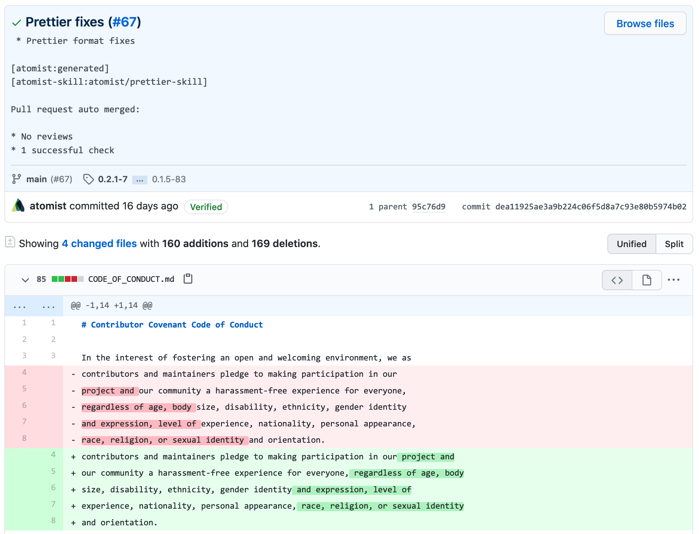
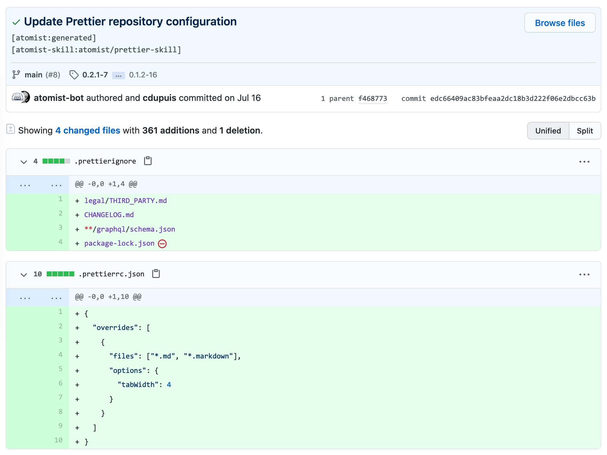
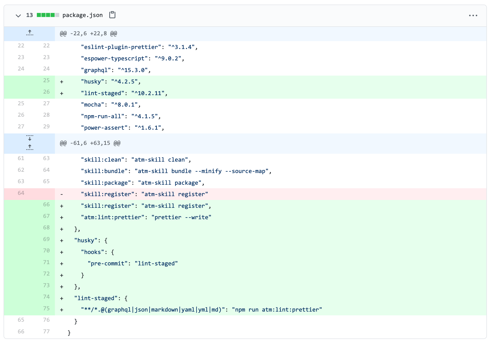

Get consistently formatted code across your repositories by applying the
[Prettier][prettier] opinionated formatter on every push.

-   You push and your code gets formatted
-   No need to discuss style in code review
-   Saves you time and energy
-   Applies same Prettier configuration across your organization
-   Also supports repository-specific Prettier configurations
-   Uses GitHub Checks to signal formatting issues
-   Fixes can be provides directly to branch or via pull requests
-   Optionally can configure projects to automatically run Prettier locally

[prettier]: https://prettier.io/ "Prettier - Opinionated Code Formatter"

### Prettier fixes on every push

### Consistent configuration across all repositories

### Run prettier locally with git hooks

