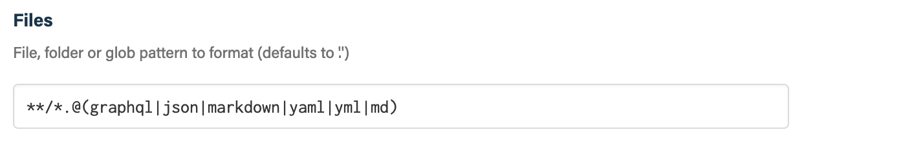
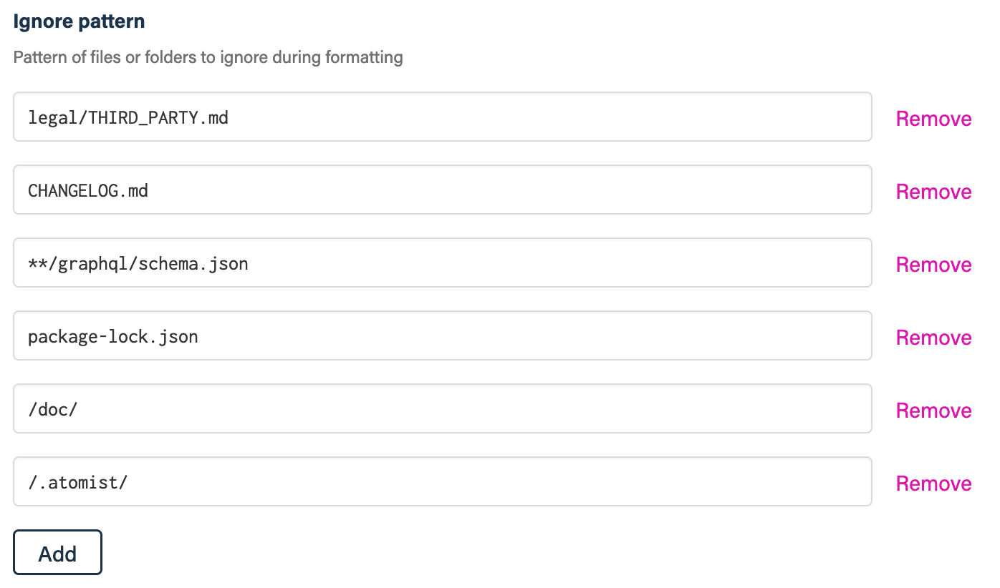
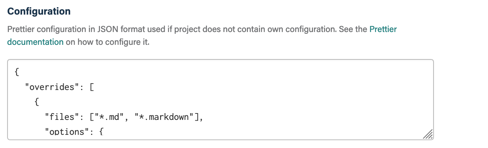
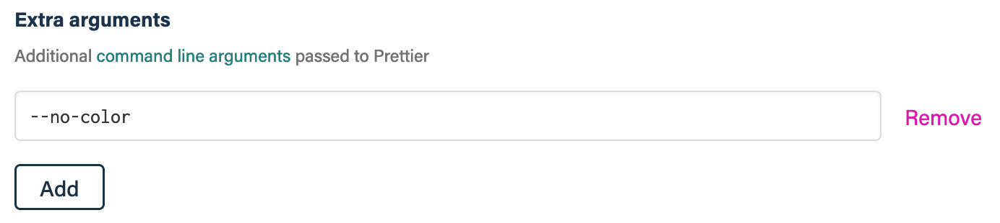
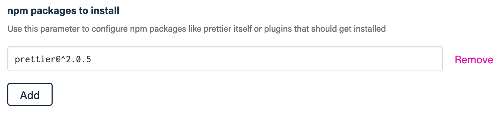
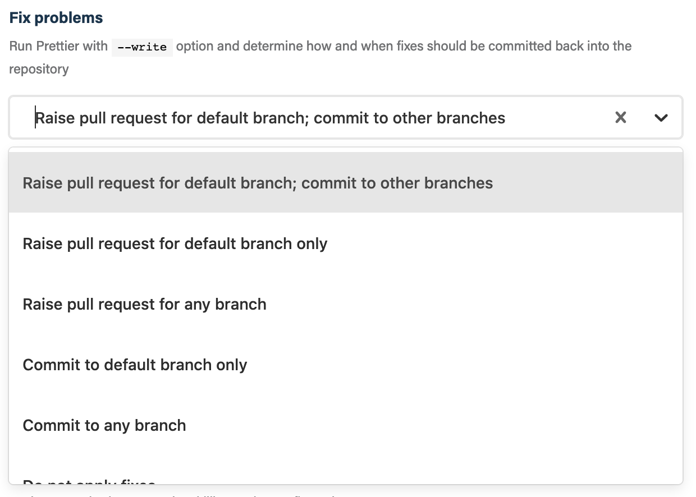
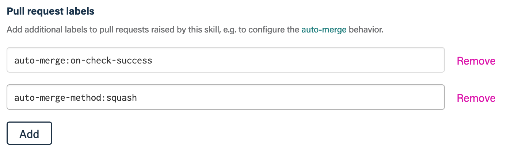
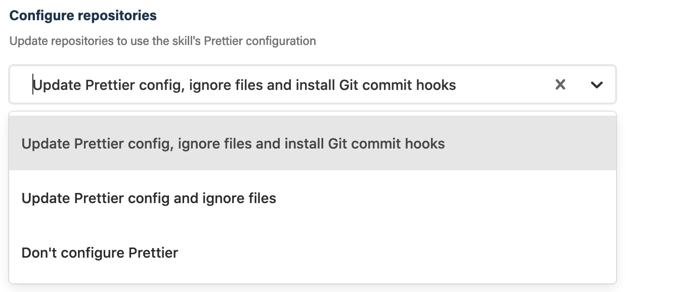

## Before you get started

Connect and configure these integrations:

1.  [**GitHub**](https://go.atomist.com/catalog/integration/github "GitHub Integration")
    _(required)_

## How to configure

1.  **Select which files to format**

    

    By default, the Prettier skill formats every supported file in your project.

    Use this parameter to provide the file, folder or glob pattern to format
    with Prettier.

1.  **Select files or folders to ignore**

    

    To speed up formatting or avoid formatting specific files, select which
    files and folders to ignore. This allows `.gitignore` style pattern.

1.  **Specify an optional Prettier configuration in JSON format**

    

    Provide the
    [Prettier configuration](https://prettier.io/docs/en/configuration.html#basic-configuration)
    in JSON format to be used for formatting when a repository does not have its
    own configuration.

1.  **Specify optional arguments to Prettier**

    

    Configure optional arguments to pass to the `prettier` command. See the
    [Prettier documentation](https://prettier.io/docs/en/cli.html) for a list of
    available arguments.

1.  **Configure NPM packages to be installed**

    

    If your Prettier configuration needs special packages or plugins, use this
    parameter to specify the NPM packages that should be installed in addition
    to dependencies from the `package.json`.

    You can also use this parameter to specify the version of `prettier` you
    intend to use for formatting.

1.  **Specify how to apply fixes**

    

    Choose which fix apply option to use or choose not to apply fixes. When a
    fix option is selected, Prettier will be run with the `--write` option. The
    following options are available:

    -   **Raise pull request for default branch; commit to other branches** -
        with this option, fixes on the default branch will be submitted via a
        pull request; fixes on other branches will be committed straight onto
        the branch
    -   **Raise pull request for default branch only** - with this option, fixes
        on the default branch will be submitted via a pull request; fixes on
        other branches will not be persisted
    -   **Raise pull request for any branch** - with this option, fixes on all
        branches will be submitted via a pull request
    -   **Commit to default branch only** - with this option, fixes on the
        default branch will be committed straight to the branch; fixes on other
        branches will not be persisted
    -   **Commit to any branch** - with this option, fixes on all branches will
        be committed straight to the branch
    -   **Do not apply fixes**

    Pull requests that get raised by this skill will automatically have a
    reviewer assigned based on the person who pushed code. Pull requests that
    are not needed any longer, i.e., because all format violations were fixed
    manually, are closed automatically.

1.  **Configure pull request labels**

    

    Add additional labels to pull requests raised by this skill.

    This is useful to influence how and when the PR should be auto-merged by the
    [Auto-Merge Pull Requests](https://go.atomist.com/catalog/skills/atomist/github-auto-merge-skill)
    skill.

1.  **Add Prettier configuration to repositories for local use**

    

    Choose one of these options to add the Prettier configuration to your
    repositories, and optionally enable
    [Git hooks](https://git-scm.com/book/en/v2/Customizing-Git-Git-Hooks) to get
    support for running prettier locally with the same configuration.

    If you choose to install the Git commit hooks, Prettier will be run on each
    local commit you make.

    By default, the Prettier configuration will not be added to your
    repositories. Select one of these options to change the behavior:

    -   **Update Prettier config, ignore files and install Git commit hooks** -
        the Prettier configuration will be added to the repository, ignore files
        updated to ignore the Prettier configuration added, and the Git commit
        hook will be installed
    -   **Update Prettier config and ignore files** - the same behavior as
        above, without installing the Git commit hook

1.  **Determine repository scope**

    

    By default, this skill will be enabled for all repositories in all
    organizations you have connected.

    To restrict the organizations or specific repositories on which the skill
    will run, you can explicitly choose organization(s) and repositories.

1.  **Activate the skill**

    Save your configuration and activate the skill by clicking the "Enable
    skill" button.
